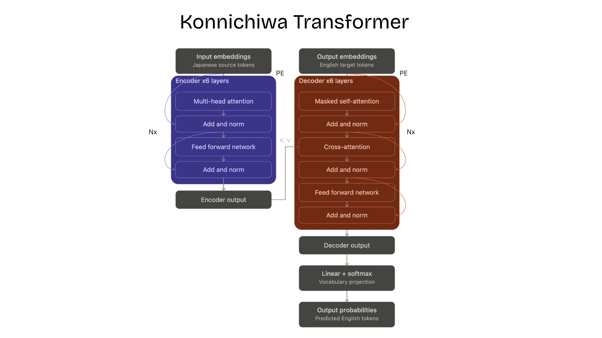
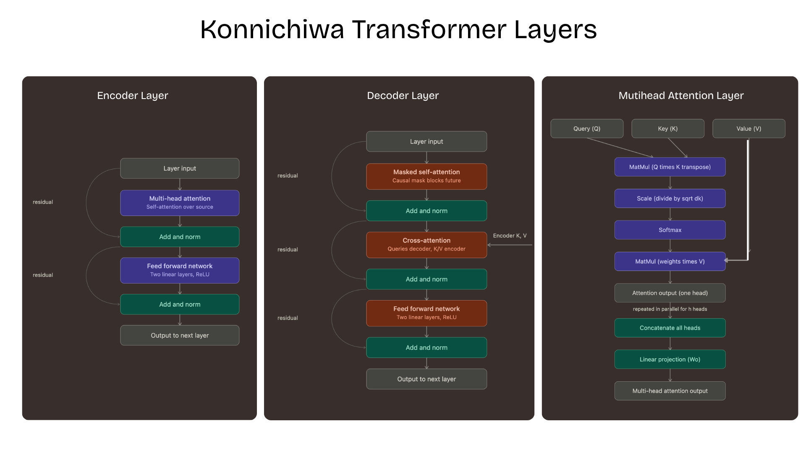
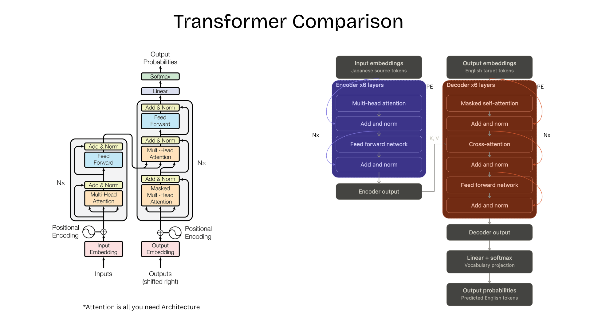

# Konnichiwa Transformer


A compact, educational Transformer implementation that learns Japanese-to-English phrase translation from scratch with PyTorch. The project exposes the building blocks normally hidden behind high-level libraries: tokenization, embeddings, positional encoding, multi-head attention, encoder/decoder stacks, masking, training, and autoregressive generation.

> **Learning project:** The included corpus contains roughly 100 everyday phrases. The model is intended to demonstrate the Transformer workflow and to memorize or closely match examples in that corpus; it is not a general-purpose Japanese translator.

## Highlights

- Japanese-to-English sequence-to-sequence translation
- Custom vocabulary-based tokenizer with Japanese and ASCII punctuation support
- From-scratch encoder-decoder Transformer implementation
- Source padding masks and decoder causal masks
- Teacher-forced training with cross-entropy loss and Adam
- Greedy, token-by-token translation in an interactive terminal
- Apple Silicon (MPS), CUDA, and CPU device selection

## Architecture



### Transfomer Layers 


### Original Transformre Comparison 



## Repository layout

```text
train_transformer/
├── train.py       # Training loop and interactive translation CLI
├── model.py       # Transformer, attention, encoder, and decoder modules
├── dataset.py     # Japanese-English examples and PyTorch Dataset
├── tokenizer.py   # Custom text ↔ token-ID tokenizer
├── new-arch/      # Architecture diagrams
└── LICENSE        # MIT License
```

## How it works

### 1. Tokenization

`SimpleTokenizer` builds a separate vocabulary for Japanese source text and English target text. It reserves four special tokens:

| Token | Purpose |
|---|---|
| `<pad>` | Fills sequences to a fixed length for batching. |
| `<sos>` | Signals the first decoder input token. |
| `<eos>` | Signals that generated output is complete. |
| `<unk>` | Represents a word or phrase absent from the training vocabulary. |

Punctuation such as `.`, `?`, `。`, and `？` is split into its own token. This means `こんにちは` and `こんにちは。` are handled consistently.

### 2. Dataset preparation

`TranslationDataset` turns each pair in `PAIRS` into three fixed-length tensors:

- `src`: Japanese source IDs, including `<sos>` and `<eos>`.
- `tgt_input`: English IDs given to the decoder, shifted right.
- `tgt_label`: the expected next English IDs, shifted left.

For example, an English target `hello .` is trained as:

```text
decoder input:  <sos> hello .
expected label: hello . <eos>
```

It also produces masks so padding is ignored and the decoder cannot look ahead to future target words.

### 3. Transformer model

The model uses a smaller configuration suitable for the deliberately small training set:

| Setting | Value |
|---|---:|
| Maximum sequence length | 20 |
| Embedding/model width (`d_model`) | 128 |
| Attention heads | 4 |
| Encoder/decoder layers | 2 each |
| Feed-forward width (`d_ff`) | 256 |
| Dropout | 0.0 |
| Learning rate | 0.001 |
| Epochs | 100 |

The encoder gives each Japanese token context from the other Japanese tokens. The decoder generates English autoregressively: masked self-attention uses only words already produced, while cross-attention reads the encoder’s Japanese representation.

### 4. Training and translation

During training, the model sees the correct preceding English words (teacher forcing). Cross-entropy loss measures next-token prediction quality; `Adam` updates the weights.

During translation, no English target is supplied. The model starts with `<sos>`, selects the highest-scoring next token, appends it to its input, and repeats until `<eos>` or the maximum length is reached.

## Installation

Prerequisite: Python 3.10 or newer.

```bash
git clone <your-repository-url>
cd train_transformer
python3 -m venv .venv
source .venv/bin/activate
pip install torch
```

On Windows, activate the environment with:

```powershell
.venv\Scripts\Activate.ps1
```

## Run

```bash
python3 train.py
```

The script trains first, then opens an interactive prompt:

```text
Training complete. Type a Japanese sentence to translate.
Type 'quit' to exit.

Japanese: こんにちは
English: hello.

Japanese: こんばんは。
English: good evening.

Japanese: quit
```

Results vary slightly between runs because the model begins with random weights. For best results, test phrases in or very close to `PAIRS` in `dataset.py`.

## Device support

`train.py` selects the best available PyTorch device in this order:

1. **MPS** for supported Apple Silicon Macs
2. **CUDA** for compatible NVIDIA GPUs
3. **CPU** as a portable fallback

## Extending the project

To improve coverage or quality:

1. Add clean, non-conflicting Japanese-English pairs to `PAIRS` in `dataset.py`.
2. Keep source/target language order consistent: `(japanese, english)`.
3. Retrain after every dataset change; vocabularies are built at startup.
4. Increase the model size or epoch count only after expanding the dataset substantially.
5. For a real translation system, replace this small phrase corpus and word-level tokenizer with a large parallel corpus and subword tokenization.

## Limitations

- The vocabulary is built only from the included examples, so unseen Japanese text becomes `<unk>`.
- Japanese phrases are not linguistically segmented into morphological subwords.
- Greedy decoding chooses one highest-probability token at each step; it does not use beam search.
- Duplicate or conflicting training inputs can lead to either valid target being generated.

## License

This project is licensed under the [MIT License](LICENSE).
